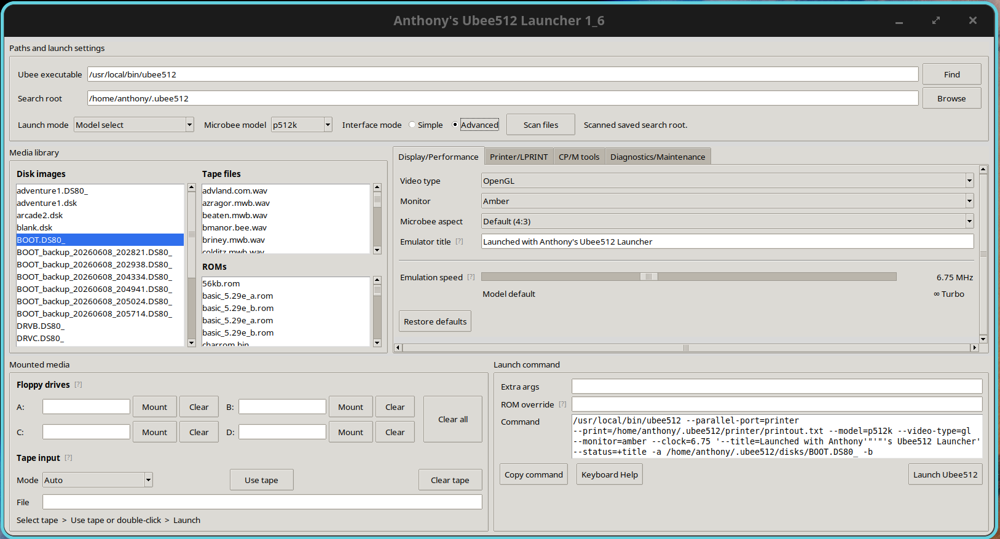

# Anthony's Ubee512 Launcher

Anthony's Ubee512 Launcher is a desktop launcher for the uBee512 emulator.

The project currently includes separate launcher versions for:

- Linux
- macOS
- Windows

The launcher is designed to make it easier to select uBee512 paths, scan for ROMs, disks and tape files, preview the launch command, and start the emulator without manually typing long command-line instructions each time.



## Current Status

### Linux

**Current Linux version:** `1_6`

The Linux launcher has been updated and rebuilt for version `1_6`.

This version includes:

- Display/Performance landing tab
- selectable video rendering and monitor modes
- safe preset Microbee aspect ratios
- default launcher-branded emulator title with a custom title override
- model-aware clock presets from 1 MHz to 150 MHz
- Turbo mode and tab-level display defaults
- scrollable Advanced tabs for smaller windows and varied display scaling
- improved launch behaviour
- scanning for ROMs, disk images and tape files
- clearer diagnostics for missing folders and files
- updated tape-loading guidance
- support for mounting floppy disk images to drives A, B, C and D
- printer output support for BASIC `LPRINT` and `LLIST`
- CP/M tools integration for inspecting and copying files to and from disk images
- updated Linux executable and ZIP package

### macOS

**Current macOS version:** `1_6`

Two macOS builds are available:

- **Apple Silicon / ARM64** for Macs using Apple Silicon processors such as M1, M2, M3 or M4
- **Intel / x86_64** for Intel-based Macs

The macOS launcher uses macOS-specific path handling and system calls for opening files and folders.

The Intel build has been built as a native 64-bit `x86_64` application and the launcher interface has been tested on macOS High Sierra 10.13.6. The uBee512 emulator itself was not installed on that test machine, so emulator launch testing for the Intel build is still limited.

### Windows

**Current Windows version:** `1_6`

The Windows launcher has been updated and rebuilt for version `1_6`.

This version includes:

- Display/Performance landing tab
- selectable video and monitor modes
- safe preset Microbee aspect ratios
- default launcher-branded emulator title with a custom override
- clock-speed presets from 1 MHz to 150 MHz and Turbo mode
- scrollable Advanced tabs for smaller windows and varied display scaling

The Windows version uses Windows-specific path handling and Windows system calls for opening files and folders.

## Project Structure

```text
Ubee512-Launcher/
├── Source/
│   ├── AnthonysUBee512Launcher.py
│   ├── AnthonysUBee512Launcher_Mac_ARM.py
│   ├── AnthonysUBee512Launcher_Mac_Intel.py
│   └── AnthonysUbee512WindowsLauncher.py
├── LICENSE
└── README.md
```

## Downloads

Packaged releases are published through GitHub Releases.

Current release: **v1.6**

Available builds:

- Linux
- macOS Apple Silicon / ARM64
- macOS Intel / x86_64
- Windows

Open the repository's **Releases** page and download the package for your platform.

## Running the Linux Version

Download the Linux ZIP from the latest GitHub Release, extract it, then run:

```bash
./AnthonysUBee512Launcher
```

You may need to make the file executable first:

```bash
chmod +x ./AnthonysUBee512Launcher
```

## Running the macOS Version

Download the appropriate macOS package from the latest GitHub Release:

- Apple Silicon / ARM64
- Intel / x86_64

Extract the package and open the launcher application.

The macOS builds are not currently Apple-notarised, so macOS may block the app the first time it is opened.

Depending on your macOS version, you may need to:

1. right-click the app and choose **Open**, or
2. allow it through **System Settings / System Preferences → Privacy & Security**

The macOS launcher is intended for an existing uBee512 setup and uses macOS-specific default paths where appropriate.

## Running the Windows Version

Download the Windows ZIP from the latest GitHub Release, extract it, then run the launcher executable.

The Windows version is intended for a Windows uBee512 setup and uses Windows-specific path handling.

## Source Files

### Linux

```text
Source/AnthonysUBee512Launcher.py
```

### macOS Apple Silicon

```text
Source/AnthonysUBee512Launcher_Mac_ARM.py
```

### macOS Intel

```text
Source/AnthonysUBee512Launcher_Mac_Intel.py
```

### Windows

```text
Source/AnthonysUbee512WindowsLauncher.py
```

## Build Notes

Each platform should be built from its corresponding source file.

The general release process is:

1. update the appropriate source file
2. test the source directly
3. commit and push the source
4. build the platform package
5. create the platform ZIP package
6. test the packaged application
7. tag the release
8. publish the ZIP through GitHub Releases
9. update documentation if needed

### Linux Build Example

```bash
cd ~/Documents/Git/Ubee512-Launcher
python3 -m venv .venv
source .venv/bin/activate
python -m pip install --upgrade pip
python -m pip install pyinstaller
python -m PyInstaller --onefile --windowed --name AnthonysUBee512Launcher Source/AnthonysUBee512Launcher.py
```

The generated executable appears in:

```text
dist/AnthonysUBee512Launcher
```

### macOS Intel Build Example

A native Intel build can be created on an Intel Mac with:

```bash
python3 -m PyInstaller \
  --windowed \
  --name "Anthonys Ubee512 Launcher" \
  --target-arch x86_64 \
  Source/AnthonysUBee512Launcher_Mac_Intel.py
```

## CP/M Tools Notes

The launcher includes basic CP/M tools integration for inspecting disk images and copying files to and from disk images.

The launcher expects tools such as:

```text
cpmls
cpmcp
diskdefs
```

The `diskdefs` file should be stored in the same folder as the CP/M tools where required.

On Windows, for example, the CP/M tools may be stored together in a folder such as:

```text
E:\ubee512\tools\cpmtools-2.10\
```

On Linux or macOS, the tools may be installed system-wide or stored with the uBee512 tools, depending on the user's setup.

## ROMs, Disks and Tapes

The launcher can scan for:

### ROM files

```text
.rom
.bin
```

### Disk image files

```text
.dsk
.dsk.gz
.img
.hd0
.hd1
.hd2
.hdd
.ds40_
.ds80_
.ds82_
.ds84_
.ss80_
```

### Tape files

```text
.tap
.wav
```

The launcher scans from the selected search root and, where the expected uBee512 media folders exist, keeps ROMs, disks and tapes separated into their normal folders.

## Tape Loading Note

The launcher can attach tape files to the uBee512 launch command.

The exact command needed inside the emulator depends on the model and tape format.

Common examples include:

```text
LOAD ""
```

or:

```text
CLOAD
```

After issuing the load command inside the emulator, use the uBee512 tape rewind/start shortcut or console tape control as required by the emulator.

## Printer Output

The launcher includes printer output support for uBee512.

Useful BASIC commands include:

```text
OUTL#1
LPRINT "TEST"
LLIST
OUTL#0
```

`OUTL#1` sends output to the printer device.

`OUTL#0` returns output to the screen.

Printed data may not appear in the host printer output file until uBee512 closes the printer file or exits.

## Development Workflow

GitHub should be treated as the shared source of truth.

Before starting work:

```bash
git checkout main
git pull origin main
git status
```

After making useful changes:

```bash
git add .
git commit -m "Describe the change"
git push origin main
```

The source code should be treated as the primary version of the launcher. Packaged builds should always be generated from tested source.

## License

This project is released under the MIT License.
